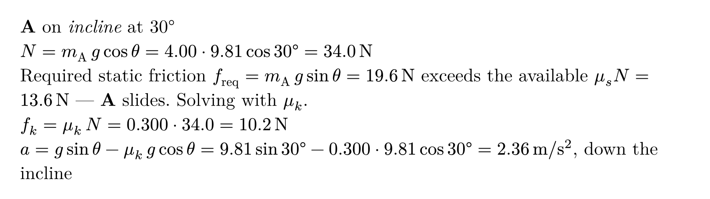

# typed-physics


Describe the situation once. The figure, the free-body diagram, the equations,
and the answer are all derived from it — and they cannot disagree with each
other.

```typst
#import "@preview/typed-physics:0.1.0": *

#let s = situation(
  ramp("incline", angle: 30deg, length: 7),
  block("A", mass: 4, on: "incline", at: 55%, mu: (s: 0.40, k: 0.30)),
)

#scene(s)
#fbd(s, "A")
#components(s, "A")
#solve(s)
```

Every physics problem in every textbook exists as four separate artifacts: a
picture of the situation, a free-body diagram, a line of algebra, and a numeric
answer. All four are usually maintained by hand, in different tools, and they
drift. Change a ramp from 30° to 37° and either the figure lies or the answer is
wrong. `typed-physics` makes those four artifacts views of a single declared
situation, so changing the declaration changes all of them together.

It is built on [CeTZ](https://typst.app/universe/package/cetz).

> `block` is this package's body constructor, so importing with `*` shadows
> Typst's own `block`. Reach for it as `std.block`, or import only the names you
> use.

## This is not a drawing library

CeTZ is already an excellent drawing library. The gap this fills is a package
that *knows mechanics*. A drawing library cannot be wrong, because it has no
opinion; `typed-physics` can disagree with you:

```typst
#block("A", mass: 4, on: "incline", at: 95%)
```

```text
error: assertion failed: typed-physics: block "A" hangs off the end of
       "incline" by 0.150 — move it back with `at:` or shrink it with `size:`
```

and, more usefully, it decides the friction regime instead of assuming it:

> Required static friction $f_"req" = m_A g sin theta = 19.6$ N exceeds the
> available $mu_s N = 13.6$ N — **A** slides. Solving with $mu_k$.

## Declaring a situation

Nothing takes a coordinate. A body says which surface it rests on and how far
along it sits, so changing `angle:` moves the hatching, the block, its rotation,
and the angle arc together.

### Environment

```typst
#ground(length: 8, mu: none)                  // name defaults to "ground"
#wall(side: left, height: 4, mu: none)        // name defaults to "wall"
#ceiling(length: 8, height: 4, mu: none)      // name defaults to "ceiling"
#ramp("incline", angle: 30deg, length: 6, mu: none)
```

`ramp` rises to the right from its foot, and `length` is measured along the
incline. A wall stands at whichever end of the scene its `side:` names.

### Bodies

```typst
#block("A", mass: 4, on: "incline", at: 55%, mu: (s: 0.40, k: 0.30))
#block("m2", mass: 3, on: "ground", touching: "m1", side: right)
```

| Argument | Meaning |
| --- | --- |
| `mass:` | a number, or content such as `$m$` to stay symbolic |
| `on:` | the name of the surface it rests on |
| `at:` | how far along that surface, as a ratio (default `50%`) |
| `touching:` | place it against a body declared earlier instead |
| `side:` | which side of that body, `left` or `right` |
| `size:` | the edge of the square, in the same units as `length:` |
| `mu:` | `0.3`, or `(s: 0.40, k: 0.30)`, or a symbol such as `$mu$` |
| `label:` | what to draw inside it, instead of its name |

A block's own `mu:` describes the contact it makes; a surface's `mu:` describes
everything that touches it. The nearer declaration wins.

### Applied loads

```typst
#force(on: "crate", magnitude: 40, angle: 0deg, label: $F$)
```

Angles are measured from the horizontal, like every other angle in the package.


## Views

Each view is available as a function taking the situation first, and as a
closure on the situation itself. Typst needs extra parentheses for the second
form, so `scene(s)` and `(s.scene)()` are the same call.

| View | What it gives you |
| --- | --- |
| `scene(s)` | the figure |
| `fbd(s, name)` | the free-body diagram, derived from the declaration |
| `components(s, name)` | the weight resolved into the surface's axes |
| `solve(s)` | the regime, the forces, and the answer |
| `steps(s)` | the same, with the substitution shown |
| `force-table(s)` | every force with its components |
| `results(s)` | the solution as a dictionary, to read numbers out of |
| `draw(s)` | the scene as CeTZ elements, to draw on top of |


```typst
#scene(s, labels: "name", angles: "value", loads: true, style: (:))
```

`labels:` is `"name"`, `"mass"`, `"both"`, or `"none"`. `angles:` is `"value"`
(`30°`), `"symbol"` (`θ`), `"both"`, or `"none"`.

```typst
#fbd(s, "A", axes: auto, outline: true, solve: true, style: (:))
```

Arrows are drawn in proportion to the forces they stand for, so a free-body
diagram reads as a comparison. That is only honest when every magnitude is
known; as soon as one is symbolic they all fall back to one length.

## Symbolic first, numeric optional

Give masses and coefficients as numbers and you get numbers. Give them as
symbols and you get the closed form.

```typst
#let s = situation(
  ramp("incline", angle: 30deg, length: 6),
  block("A", mass: $m$, on: "incline", at: 50%, mu: (s: $mu_s$, k: $mu_k$)),
)
#solve(s, assume: "sliding")
```

> $N = m g cos theta$
> $a = g sin theta - mu_k g cos theta$, down the incline

Give both and `steps(s)` shows the substitution in between:



Whether a body slides is a question about numbers. When a coefficient is
symbolic, the package says so instead of guessing:

```text
typed-physics cannot decide whether A slides, because the net force along the
surface is symbolic. Give the coefficients and masses as numbers, or state the
regime with solve(assume: "static") or solve(assume: "sliding").
```

With `assume:` the report states that the regime was given rather than checked.

## Drawing on top

Every body and surface is a named CeTZ group, so annotations never require
editing the situation.

```typst
#cetz.canvas({
  import cetz.draw: circle, line
  draw(s)
  circle("A.center", radius: 0.06, fill: red)
  line("A.center", "incline.apex")
})
```

| Anchors | |
| --- | --- |
| bodies | `center`, `contact`, `uphill`, `downhill`, `outward` |
| surfaces | `start`, `end`, `surface` |
| ramps also | `foot`, `apex`, `base` |

## Styling

Every view takes `style:`, merged over the package defaults, and `situation()`
takes one for the whole situation.

```typst
#let s = situation(..., style: (body-fill: luma(230), scale: 0.9))
#scene(s, style: (force-colors: (applied: red)))
```

Keys include `block-size`, `surface-stroke`, `surface-fill`, `hatch-stroke`,
`hatch-spacing`, `hatch-length`, `body-stroke`, `body-fill`, `angle-stroke`,
`angle-radius`, `construction-stroke`, `force-stroke`, `force-length`,
`force-floor`, `force-colors`, `label-text`, `force-text`, `angle-text`, and
`scale`. An unknown key is an error, not a silent no-op.

## What 0.1.0 does not do yet

The vocabulary is deliberately being grown one problem at a time. Not here yet:

- Connectors — `rope`, `pulley`, `spring`, `link` — and the multi-body solve they imply.
- Contact pairs between touching bodies, and the action–reaction annotation that goes with them.
- Torques, and with them ladders, rods, and solving for a symbol.
- Bodies other than square blocks.

The solver handles one body resting on a ground or a ramp, with friction and
any number of applied loads. Anything else says what it cannot do and why.

## License

MIT
