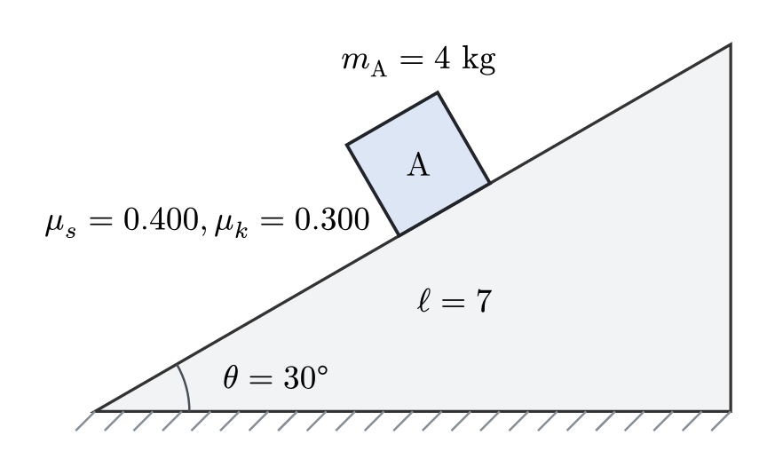
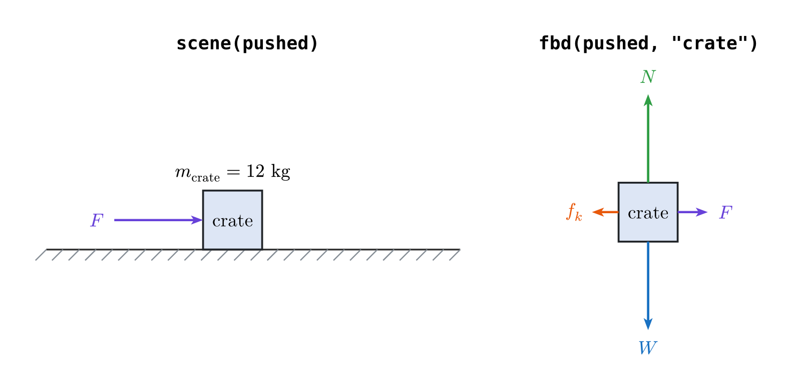
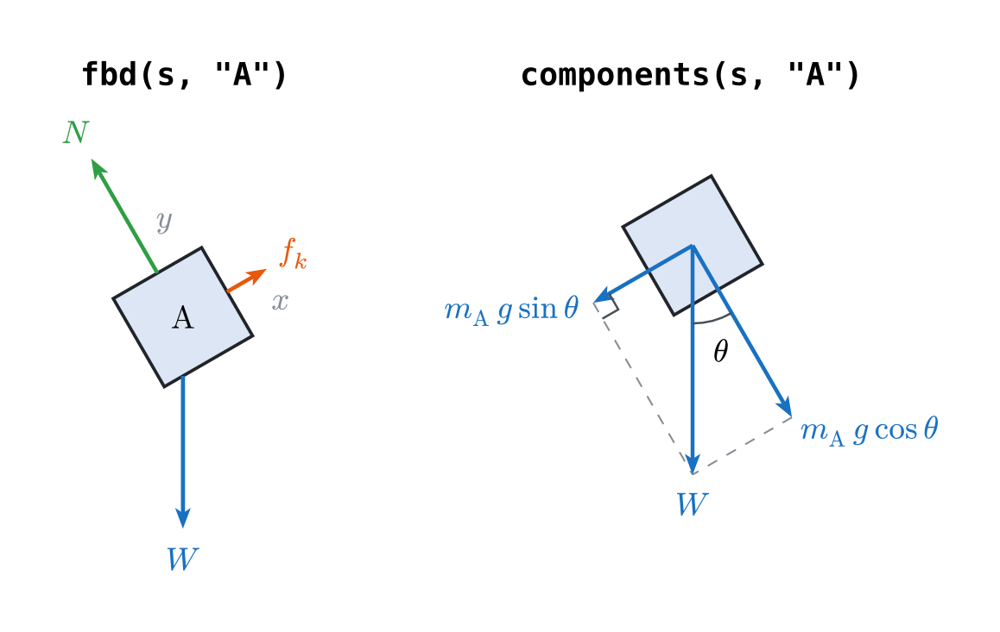

# typed-physics



Describe the situation once. The figure, the free-body diagram, the equations,
and the answer are all derived from it — and they cannot disagree with each
other.

```typst
#import "@preview/typed-physics:0.1.0": *

#let s = situation(
  ramp("incline", angle: 30deg, length: 7),
  block("A", mass: 4, on: "incline", at: 55%, mu: (s: 0.40, k: 0.30)),
)

#scene(s)
#fbd(s, "A")
#components(s, "A")
#solve(s)                    // a = 2.36 m/s², down the incline
#solve(s, find: "normal")    // N = 34.0 N
```

Every physics problem in every textbook exists as four separate artifacts: a
picture of the situation, a free-body diagram, a line of algebra, and a numeric
answer. All four are usually maintained by hand, in different tools, and they
drift. Change a ramp from 30° to 37° and either the figure lies or the answer is
wrong. `typed-physics` makes those four artifacts views of a single declared
situation, so changing the declaration changes all of them together.

It is built on [CeTZ](https://typst.app/universe/package/cetz).

The [user guide](docs/documentation.pdf) documents every element, view,
argument, and style key, with a runnable example for each.

> `block` is this package's body constructor, so importing with `*` shadows
> Typst's own `block`. Reach for it as `std.block`, or import only the names you
> use.

## This is not a drawing library

CeTZ is already an excellent drawing library. The gap this fills is a package
that *knows mechanics*. A drawing library cannot be wrong, because it has no
opinion; `typed-physics` can disagree with you:

```typst
#block("A", mass: 4, on: "incline", at: 95%)
```

```text
error: assertion failed: typed-physics: block "A" hangs off the end of
       "incline" by 0.150 — move it back with `at:` or shrink it with `size:`
```

and, more usefully, it decides the friction regime instead of assuming it, then
hands you the numbers to write about:

```typst
#let answer = results(s)
#answer.regime            // "sliding"
#answer.required.value    // 19.6 — the friction the situation needs
#answer.available.value   // 13.6 — the most this contact can supply
```

## Declaring a situation

Nothing takes a coordinate. A body says which surface it rests on and how far
along it sits, so changing `angle:` moves the hatching, the block, its rotation,
and the angle arc together.

### Environment

```typst
#ground(length: 8, from: none, mu: none)      // name defaults to "ground"
#wall(side: left, height: 4, from: none)      // name defaults to "wall"
#ceiling(length: 8, height: 4, from: none)    // name defaults to "ceiling"
#ramp("incline", angle: 30deg, length: 6, facing: right, from: none, symbol: auto)
#arc("loop", radius: 2, start-angle: -90deg, end-angle: 270deg,
     side: "inside", from: "ground.end")
```

`length` is measured along the incline, and `facing:` says which way a ramp
climbs. `symbol:` names its inclination in the algebra, instead of `θ`.

`from:` is what lets surfaces meet, so a ramp can lead onto a shelf:

```typst
#let s = situation(
  ground("approach", length: 4),
  ramp("incline", angle: 25deg, length: 4, from: "approach"),
  ground("shelf", length: 2.5, from: "incline.apex"),
)
```

Without it every surface starts at the origin. A wall with no `from:` still
stands at the edge of everything placed before it.

### Bodies

```typst
#block("A", mass: 4, on: "incline", at: 55%, mu: (s: 0.40, k: 0.30))
#block("crate", mass: 6, on: "ground", size: (1.6, 0.9))
#ball("b", mass: 2, on: "ground", at: 55%, radius: 0.45)
#point-mass("p", mass: 1, on: "ground", at: 80%)
#disk("d", mass: 2, on: "ground", radius: 0.5)
#ring("h", mass: 2, on: "ground", radius: 0.5)
#block("m2", mass: 3, on: "ground", touching: "m1", side: right)
#block("B", mass: 2, hanging: (on: "ceiling", at: 50%), drop: 1.6)
```

`block`, `ball`, and `point-mass` take the same placement arguments and differ
only in what is drawn.

| Argument | Meaning |
| --- | --- |
| `mass:` | a number, or content such as `$m$` to stay symbolic |
| `on:` | the name of the surface it rests on |
| `at:` | how far along that surface, as a ratio (default `50%`) |
| `touching:` | place it against a body declared earlier instead |
| `side:` | which side of that body, `left` or `right` |
| `size:` | the edge of a square, or a `(width, height)` pair |
| `radius:` | the radius of a ball or the dot of a point mass |
| `radius-mark:` | show the centre dot and radial spoke (disk: `true`; ring: `false`) |
| `orientation:` | where that optional radial spoke points |
| `hanging:` | hang it below an attachment point instead of resting it on anything |
| `drop:` | how far below that point it hangs |
| `mu:` | `0.3`, or `(s: 0.40, k: 0.30)`, or a symbol such as `$mu$` |
| `label:` | what to draw inside it, instead of its name |
| `symbol:` | what the mass is called in the algebra, instead of `m_A` |
| `style:` | how this body is drawn, over the diagram style |

A block's own `mu:` describes the contact it makes; a surface's `mu:` describes
everything that touches it. The nearer declaration wins.

### Connectors

```typst
#pulley("P", at: (on: "ceiling", at: 72%), radius: 0.4)
#rope(from: "A.top", to: "B.top", over: "P")
#spring(from: (on: "wall", at: 25%), to: "A.left", coils: 7)
```

Connectors are drawn, not solved. A rope tells a free-body diagram that a
tension acts along it, with a magnitude the package leaves open.

Anywhere one element pins to another, three spellings work: `"ceiling"` for an
element's default anchor, `"incline.apex"` for a named one, and
`(on: "ceiling", at: 40%)` for a point that far along a surface. Surfaces have
`start`, `end`, `surface`, and for ramps `foot`, `apex`, `base`; bodies have
`center`, `contact`, `top`, `bottom`, `left`, `right`, `uphill`, `downhill`,
`outward`; pulleys have `center`, `top`, `bottom`, `left`, `right`.

### Applied loads and motion

```typst
#force(on: "crate", magnitude: 40, angle: 0deg, label: $F$)
#velocity(on: "crate", magnitude: 5, angle: 0deg, label: $v_0$)
#angular-velocity(on: "wheel", direction: "clockwise",
                  start-angle: 220deg, end-angle: 140deg, label: $omega$)
```

Angles are measured from the horizontal, like every other angle in the package.
A velocity is drawn in its own colour and never appears in a free-body diagram.
`angular-velocity` uses that same motion styling and hugs a ball, disk, or ring;
`direction:` controls the arrowhead while the optional raw angles choose the
free part of the outline.



### Drawing-only mechanics vocabulary

Curved tracks, rotating-body outlines, rigid-body constraints, and pendulums
compose through the same attachment system:

```typst
#let beam = situation(
  rod("beam", length: 6, mass: 12),
  support("A", at: "beam.start", kind: "pin"),
  support("B", at: "beam.end", kind: "roller"),
  force(on: "beam", at: 50%, magnitude: 20, angle: -90deg, label: $P$),
  torque(on: "beam", direction: "clockwise", label: $M$),
)
#scene(beam)

#let clock = situation(
  ceiling(length: 5, height: 4),
  pendulum("bob", from: (on: "ceiling", at: 50%),
    length: 2.8, angle: 24deg, mass: 1.5),
)
#scene(clock, labels: "both")
```

`rod`, `pivot`, `support`, `torque`, `arc`, `disk`, `ring`, and `pendulum`
currently draw and expose named anchors; they deliberately do not add
rotational, circular-motion, or pendulum equations to `solve()`.
The radius mark is shown by default on a disk and hidden by default on a ring.
Either shape accepts `radius-mark: true` or `false`. When shown, the spoke
reaches the rim and its label chooses a horizontal or vertical position away
from it.
At a junction between an `arc` and a straight surface, the straight foundation
keeps its hatches and nearby curved hatches are omitted until they fit cleanly.

## Views

Every view is a function taking the situation first.

| View | What it gives you |
| --- | --- |
| `scene(s)` | the figure |
| `fbd(s, name)` | the free-body diagram, derived from the declaration |
| `components(s, name)` | the weight resolved into the surface's axes |
| `solve(s, find:)` | one stated quantity |
| `force-table(s)` | every force with its components |
| `results(s)` | the solution as a dictionary, to read numbers out of |
| `draw(s)` | the scene as CeTZ elements, to draw on top of |



```typst
#scene(s, labels: "name", angles: "value", loads: true, frictions: false,
       lengths: false, dimensions: (), forces: none, components: none,
       style: (:))
```

`labels:` is `"name"`, `"symbol"` (`m_A`), `"mass"` (`m_A = 4 kg`), `"both"`,
or `"none"`. `angles:` is `"value"` (`30°`), `"symbol"` (`θ`), `"both"`
(`θ = 30°`), or `"none"`. Both also accept the structured overrides described
below. `frictions:` writes each contact's coefficients beside the body that
makes it, `lengths:` writes every surface's length as `ℓ = 7`, and `forces:`
draws a body's force arrows where that body sits instead of in a diagram of its
own. `components:` resolves the weight on the named body in the same scene.
Both selectors take one body name, several names, or `true` for every body.

### Dimension annotations

Dimensions belong to one scene rather than to the physical situation:

```typst
#scene(
  s,
  dimensions: dimension(
    from: "spring.start",
    to: "spring.end",
    orientation: "aligned",
    offset: 0.75,
    side: "above",
    label: $L_0$,
    label-position: "center",
  ),
)
```

Endpoints can be ordinary named anchors, connector `start`, `end`, or `center`
anchors, ratio attachments, or raw `(x, y)` points. `orientation: "aligned"`
follows the span between the anchors. `"horizontal"` measures their
x-separation, while `"vertical"` measures their y-separation. The axis-aligned
modes add orthogonal projections automatically, which makes ramp run and rise
annotations straightforward.

`side:` and `offset:` place the line away from the measured points. Horizontal
dimensions use `"above"` or `"below"`; vertical dimensions use `"left"` or
`"right"`. With `side: auto`, the defaults are above and right respectively.
`label-position:` is `"above"`, `"below"`, or `"center"`. Centered labels
interrupt the line with a gap that grows with their content.

`arrows:` selects `"both"`, `"start"`, `"end"`, or `"none"`;
`arrow-tip:` and `arrow-scale:` customize the heads. `stroke:`, `color:`, and
`text:` style one annotation, with grey lines as the default. Projection lines
are dashed and stop with `extension-gap:` clearance before the first body, rod,
or straight surface they encounter; `extension-stroke:` overrides their dash
and weight.

### Forces and components in a scene

```typst
#scene(s, forces: "A", components: "A")
```

The component construction closes onto the same weight arrow drawn by
`forces:`, so the scene shows one weight rather than two competing arrows.
Use `components:` on its own when only the weight and its resolution are
needed.

### Placing individual annotations

Keep the existing mode while overriding individual bodies or ramps:

```typst
#scene(
  s,
  labels: (
    mode: "name",
    overrides: (
      (on: "A", offset: (0.3, 0.2), rotation: -10deg),
      (on: "B", visible: false),
    ),
  ),
  angles: (
    mode: "both",
    overrides: (
      (on: "incline", offset: (0.2, 0.1), rotation: 8deg),
    ),
  ),
)
```

`offset:` is a raw `(x, y)` displacement in the same world units as the
diagram, added to the automatic label position. `(0, 0)` preserves the default.
`rotation:` rotates only the label, while `visible:` can hide one annotation.
An override can also carry its own `mode:`.

For example, keep full masses globally but show only the mass symbol on `A`:

```typst
#scene(
  s,
  labels: (
    mode: "mass",
    overrides: (
      (on: "A", mode: "symbol"),
    ),
  ),
)
```

```typst
#solve(s, find: "acceleration")
```

`find:` is `"acceleration"`, `"normal"`, `"friction"`, `"regime"`, or `auto` —
the acceleration for a sliding body, the regime for one that stays put.

```typst
#fbd(s, "A", axes: auto, outline: true, solve: true, style: (:))
```

Arrows are drawn in proportion to the forces they stand for, so a free-body
diagram reads as a comparison. That is only honest when every magnitude is
known; as soon as one is symbolic they all fall back to one length.

## Numbers as far as they reach

Every answer is carried as far towards a value as the numbers you declared
allow. All numeric gives a number; a symbolic coefficient among numbers folds
the numbers in and leaves the coefficient standing; nothing numeric gives the
closed form.

```typst
#solve(s, find: "normal")   // N = 34.0 N
#solve(s, assume: "sliding")  // a = 4.90 - 8.50 mu_k m/s², down the incline
```

```typst
#let s = situation(
  ramp("incline", angle: 30deg, length: 6),
  block("A", mass: $m$, on: "incline", at: 50%, mu: (s: $mu_s$, k: $mu_k$)),
)
#solve(s, assume: "sliding")
```

> $a = g sin theta - mu_k g cos theta$, down the incline

Whether a body slides is a question about numbers. When a coefficient is
symbolic, the package says so instead of guessing:

```text
typed-physics cannot decide whether A slides, because the net force along the
surface is symbolic. Give the coefficients and masses as numbers, or state the
regime with solve(assume: "static") or solve(assume: "sliding").
```

With `assume:` the report states that the regime was given rather than checked.

## Drawing on top

Every body and surface is a named CeTZ group, so annotations never require
editing the situation.

```typst
#cetz.canvas({
  import cetz.draw: circle, line
  draw(s)
  circle("A.center", radius: 0.06, fill: red)
  line("A.center", "incline.apex")
})
```

| Anchors | |
| --- | --- |
| bodies | `center`, `contact`, `uphill`, `downhill`, `outward` |
| surfaces | `start`, `end`, `surface` |
| ramps also | `foot`, `apex`, `base` |

## Styling

A diagram style says how a whole figure looks. `situation()` takes the one every
view starts from, and each view can override it for itself.

```typst
#let s = situation(..., style: (body-fill: luma(230), scale: 0.9))
#scene(s, style: (force-colors: (applied: red)))
```

An element style says how one declared thing looks, and wins over the diagram
style for that element alone. Three builders give argument completion while
writing one, and each returns a plain dictionary.

```typst
#block-style(fill: auto, stroke: auto, label-text: auto)
#surface-style(fill: auto, stroke: auto, hatch-stroke: auto, hatch-spacing: auto, hatch-length: auto)
#force-style(color: auto, stroke: auto, length: auto, text: auto)
#connector-style(stroke: auto, fill: auto)
```

```typst
#let s = situation(
  ramp("incline", angle: 30deg, style: surface-style(fill: rgb("#FFF9DB"))),
  block("A", mass: 4, on: "incline", style: block-style(fill: rgb("#D3F9D8"))),
  force(on: "A", magnitude: 12, style: force-style(color: rgb("#C2255C"))),
)
```

A force's style follows it into the free-body diagram, so an arrow coloured in
the scene keeps that colour in every view.

Diagram style keys include `block-size`, `surface-stroke`, `surface-fill`, `hatch-stroke`,
`hatch-spacing`, `hatch-length`, `body-stroke`, `body-fill`, `angle-stroke`,
`angle-radius`, `construction-stroke`, `right-angle-size`,
`length-label-offset`, `point-mass-fill`, `rope-stroke`, `spring-stroke`,
`pulley-fill`, `pulley-stroke`, `velocity-color`, `velocity-stroke`,
`velocity-length`, `dimension-color`, `dimension-stroke`,
`dimension-extension-stroke`, `dimension-text`,
`force-stroke`, `force-length`,
`force-floor`, `force-colors`, `label-text`, `force-text`, `angle-text`, and
`scale`. An unknown key is an error, not a silent no-op.

## What 0.1.0 does not do yet

The drawing vocabulary is where this package grows. The solver is deliberately
still: it balances one body resting on a ground or a ramp, with friction and any
number of applied loads, and nothing else.

- No solving of anything a connector touches. Ropes, springs, and pulleys are
  drawn, and a rope tells a free-body diagram that a tension acts, but no
  tension, acceleration, or contact force between bodies is computed.
- No action–reaction pairs between touching bodies.
- No force or moment balance for rods, supports, pivots, or applied torques.
  They are drawing-only declarations.
- No circular-motion solution for curved tracks, rolling dynamics for disks or
  rings, or pendulum dynamics. Their geometry is available in `scene()`.

A body the solver cannot take still draws: its figure and its free-body diagram
come from the declaration, not from an answer.

## License

MIT
